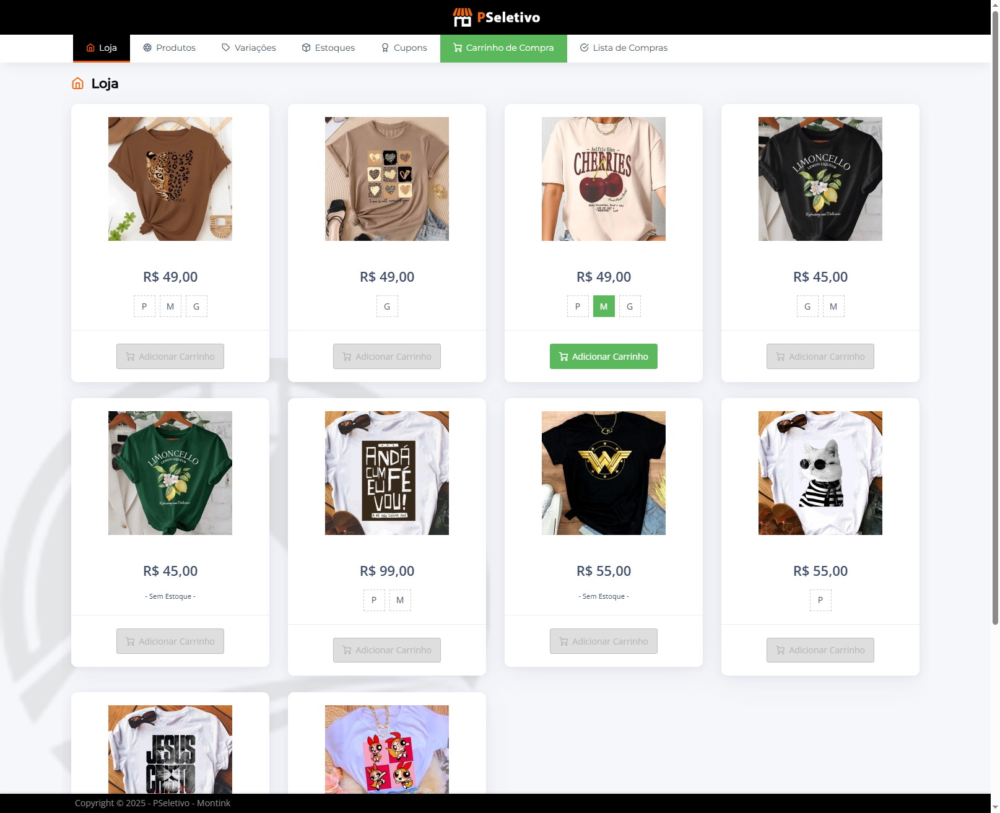
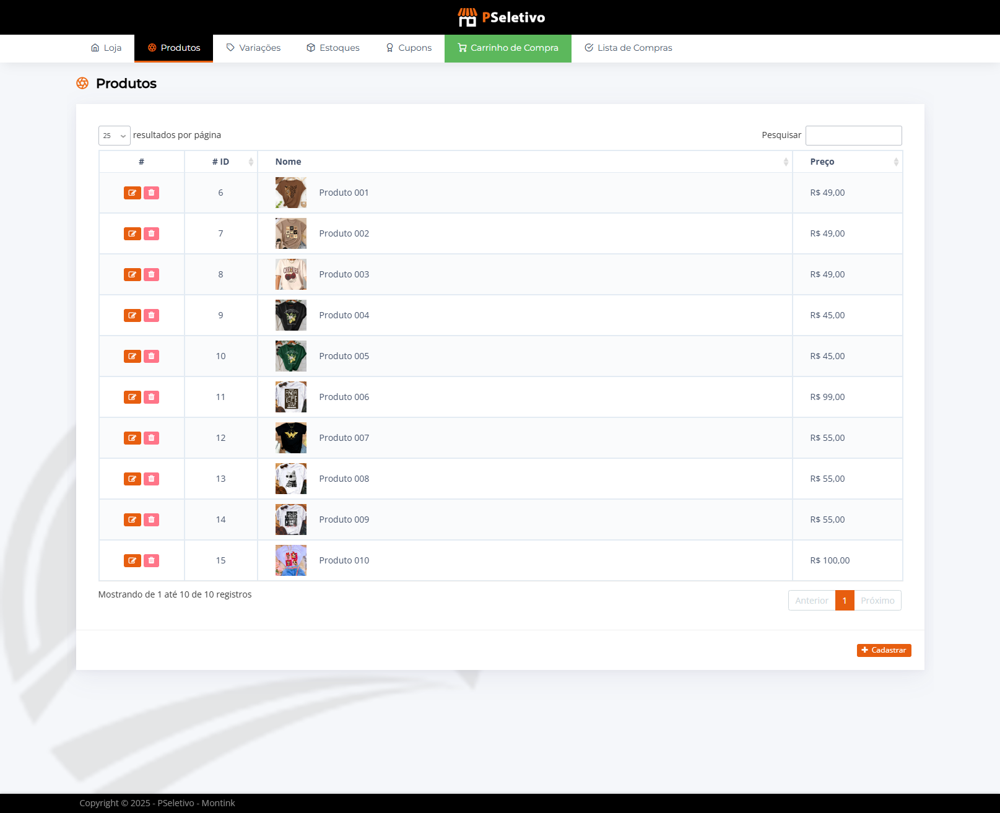
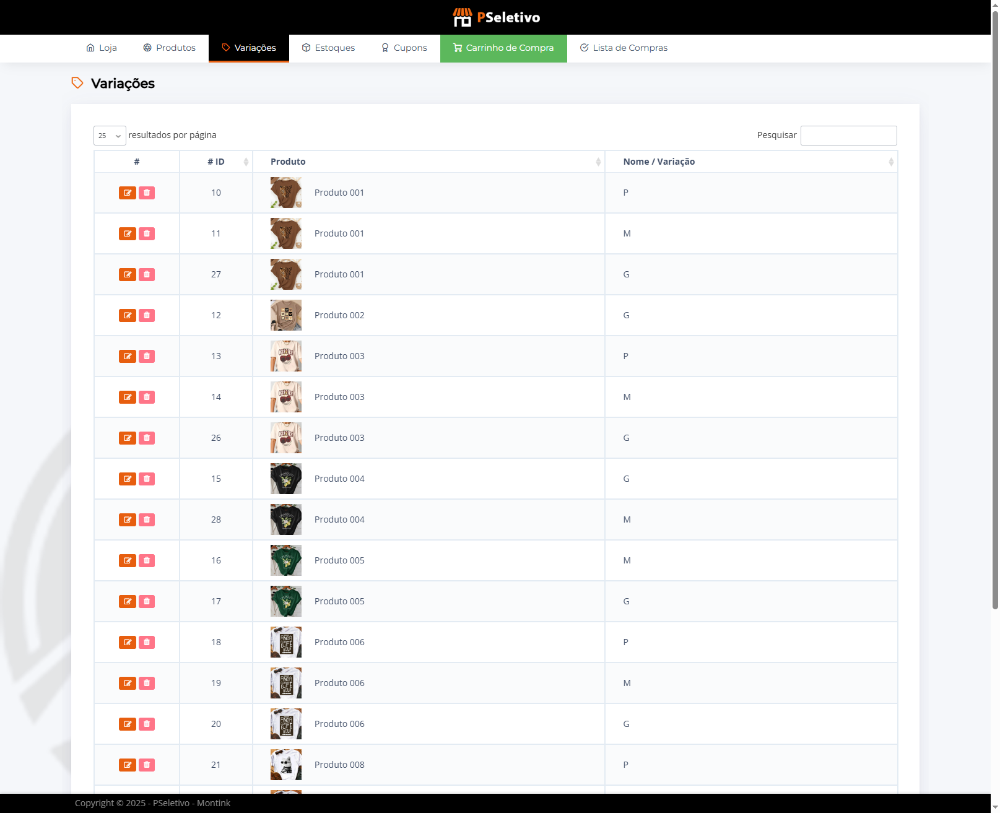
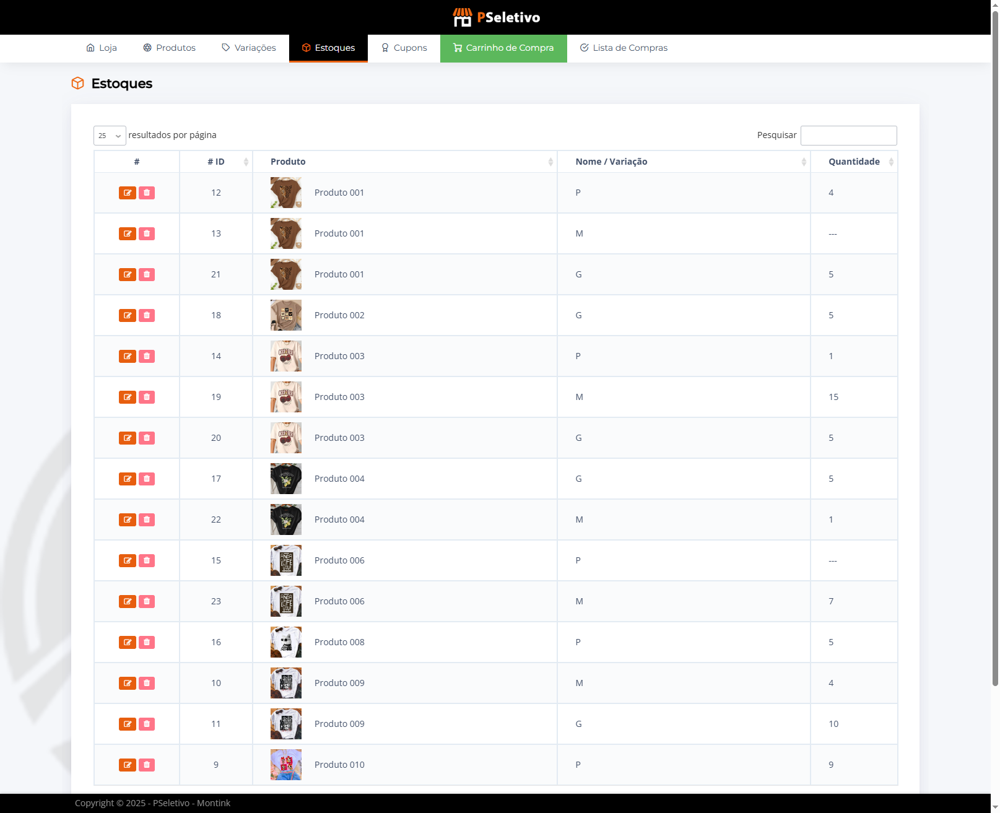
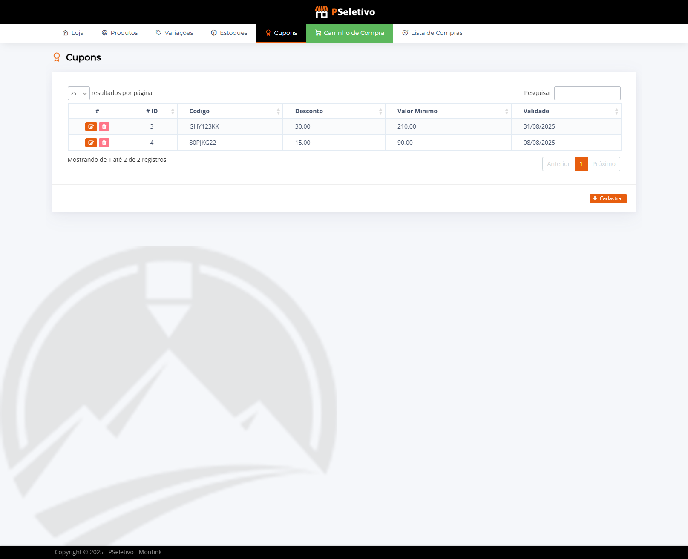
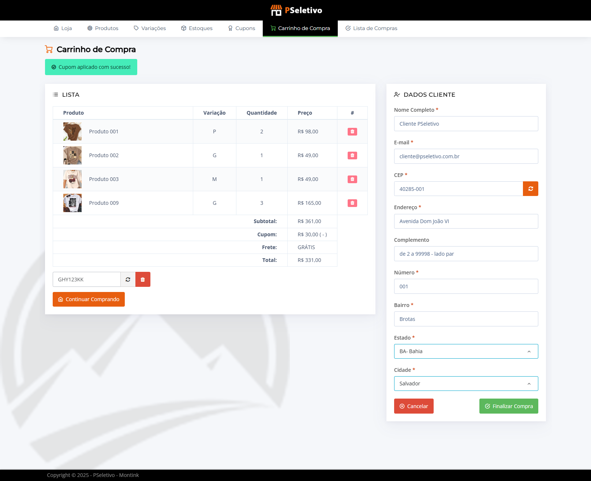
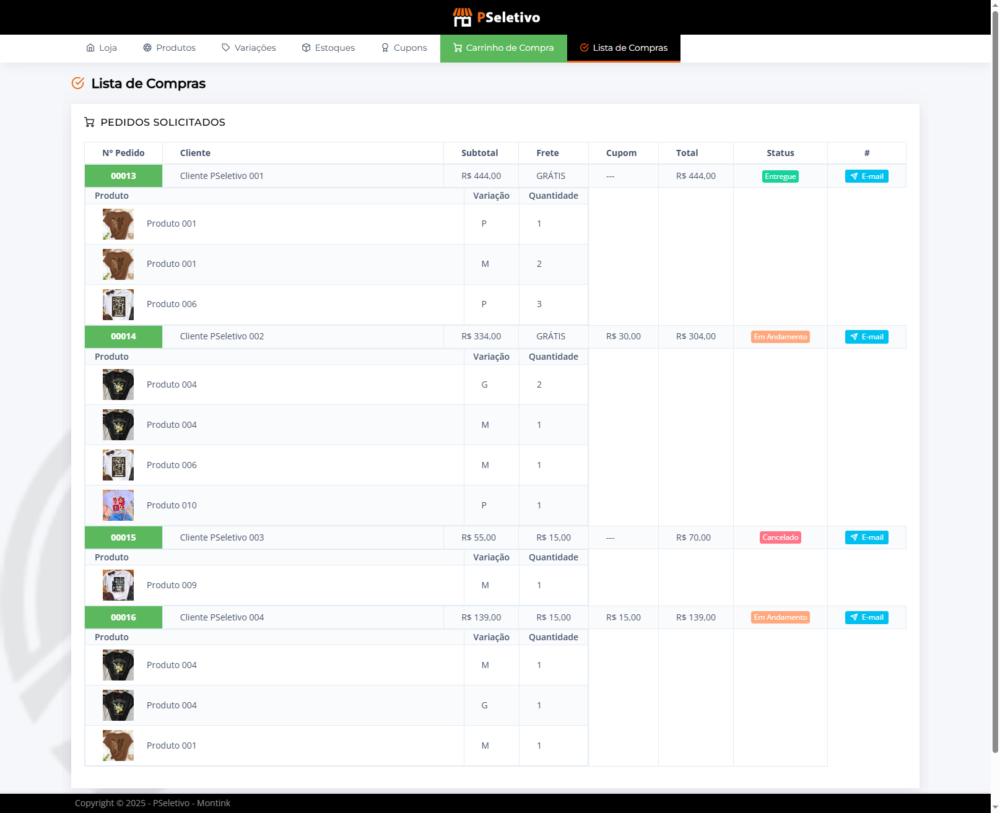
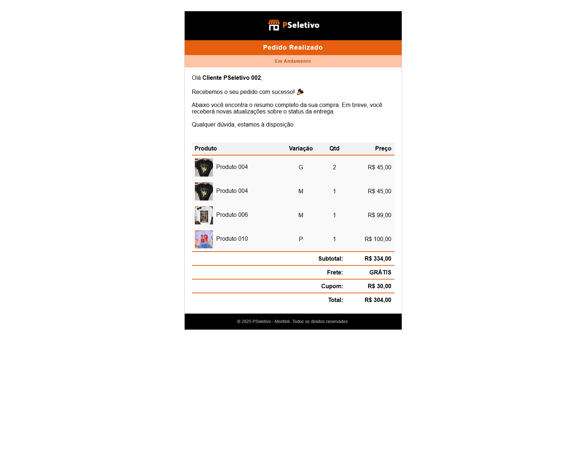

# Montink - Processo Seletivo - Desenvolvedor PHP

Acesso Disponível:<br/>
https://pseletivo.mxtera.com.br/montink/

## ⚙️ Tecnologias e Pré-requisitos

- PHP 8.*
- Laravel 12
- MySQL 8.*

## 🚀 Como executar o projeto localmente
### 1. Clonar o repositório
```bash 
  git clone git@github.com:marcoscnettoa/pseletivo-ironfence-ai.git
```
### 2. Instalar dependências
```bash 
  composer install
  npm install
```

### 3. Configurar ambiente - ( .env | SQL )
- Configurar .env / .env.example ( disponível )
```bash 
  cp .env.example .env
```

- Disponível um dump* SQL migrations no diretório root "pseletivo_montink.sql"
- Configurar .env
- ! Atenção ao DB_HOST, DB_PORT, DB_USERNAME e DB_PASSWORD necessários
```env 
DB_CONNECTION="mysql"
DB_HOST="127.0.0.1"
DB_PORT="3306"
DB_DATABASE="pseletivo_montink"
DB_USERNAME="root"
DB_PASSWORD=""
```
### 4. Comandos Úteis -| SQL
```bash 
  php artisan key:generate
  php artisan optimize:clear
  php artisan serve
```

### 5. Webhook ( Rota | Testes ) 
``` 
  loja_pedidos_id - Representa o ID do pedido 
  status          - Representa status disponíveis na aplicação 
  
  [ 'EM_ANDAMENTO', 'AGUARDANDO_PAGAMENTO', 'ENTREGUE', 'CANCELADO' ]

  Rota Ex: -> http://localhost/api/pedido/webhook?loja_pedidos_id={id}&status={status}
```

## 🖼️ Imagens - Previews

Apresentando imagens ilustrativas.
```
/previews/
├─ loja.png
├─ produtos.png
├─ produtos_variacoes.png
├─ produtos_estoques.png
├─ produtos_cupons.png
├─ carrinho-de-compra.png
├─ lista_de_compras.png
└─ notificacao-email.png
```

<br/><br/>







